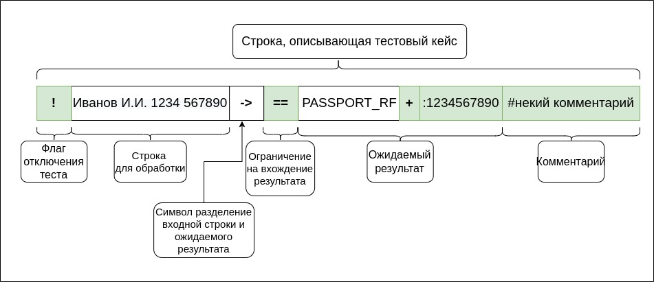
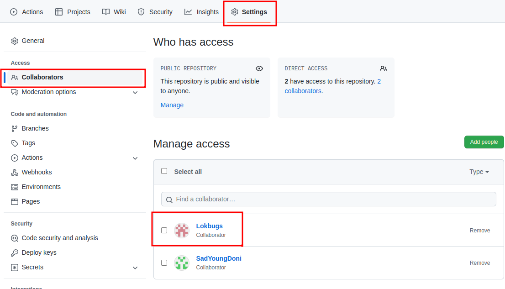

#### TBIT: The best in the tests

Практическое задание на конференцию 2022 года - тестовый бой.

#### Видео

Перед прочтением **ОБЯЗАТЕЛЬНО** посмотрите видео анонса:

#### Задача

1. Реализовать парсер текстовых описаний документов (номеров) при этом можно **опционально** ВАЛИДИРОВАТЬ и НОРМАЛИЗОВАТЬ
2. Написать как можно больше тестов на проверку других участников. 
3. Ваш код **В ПЕРВУЮ ОЧЕРЕДЬ** должен удовлетворять этим тестам (иначе победные очки не начисляются)
4. Для этого вы реализуете [UserDocParser](src/main/kotlin/codes/spectrum/conf2022/UserDocParser.kt)

#### Как выглядят описания тестов

Участники пишут свои тесты в локальном файле [local.csv](local.csv). Тест состоит их входной строки, ожидаемого
результата и (опционально) комментария. Класс, использующийся для описания
теста : [TestDesc](src/main/kotlin/codes/spectrum/conf2022/input/TestDesc.kt). Пример строки, описывающей
тест (зеленым выделены опциональные поля): 

1. `!` - флаг отключения теста. Если добавить его в начале строки - тест будет выключен. **Необязательное поле**
2. `Иванов И.И. 1234 567890` - входная строка. Именно она будет передаваться в парсеры документов.      
   **Обязательное поле**
   .
3. `->` - символ разделитель входной строки и ожидаемого результата. Не может встречаться больше одного раза.   
   **Обязательное поле**.
4. `==` - ограничение на вхождение в результат. Описывают, как будет проверяться наличие и порядок полученных
   документов. **Необязательное** поле - **ПО УМОЛЧАНИЮ** будет выставлено **==**. Бывают следующими:

| Ограничение на вхождение | Описание                                                                                           |
|--------------------------|----------------------------------------------------------------------------------------------------|
| **==**                   | **ТОЛЬКО** ожидаемые документы в **УСТАНОВЛЕННОМ** порядке                                         | 
| **~=**                   | **СОДЕРЖАТ** ожидаемые документы (но могут содержать документы помимо) в **УСТАНОВЛЕННОМ** порядке | 
| **=?**                   | **ТОЛЬКО** ожидаемые документы в **ЛЮБОМ** порядке                                                 | 
| **~?**                   | **СОДЕРЖАТ** ожидаемые документы (но могут содержать документы помимо) в **ЛЮБОМ** порядке         |

5. `PASSPORT_RF` - тип документа. Все возможные типы документов перечислены в
   классе [DocType](src/main/kotlin/codes/spectrum/conf2022/doc_type/DocType.kt). Название типов документов **
   ДОЛЖНЫ** совпадать с названием enum констант! **Обязательное поле**.
6. `+` - знак валидации. Может быть три состояния - может `отсутствовать`, `-` - не валидный документ, `+` - валидный
   документ.
   Устанавливается только в том случае, если действительно проверяется **ВАЛИДНОСТЬ** нормализованного номера документа.
   Например - валидный документ - у которого сходится контрольная сумма, не валидный - у которого не сходится.        
   **Необязательное поле.**
7. `:1234567890` - ожидаемый **НОРМАЛИЗОВАННЫЙ** номер документ. Ожидаемый нормализованный номер должен соответствовать
   структуре нормализованного документа этого типа - при парсинге файлов с тестами это проверяется. Регулярки на
   нормализованные номер можно найти в файле с описаниями типом
   документа [DocType](src/main/kotlin/codes/spectrum/conf2022/doc_type/DocType.kt). `:` - символ
   разделитель `тип документа + валидации` и `номера`. **Необязательное** поле.
8. `#комментарий` - поле с комментарием. Все, что идет после символа `#` - комментарий к тесту. Отображается при завале
   теста. Также символ `#` можно использовать для написания комментариев в файле [local.csv](local.csv).**Необязательное
   поле.**

На одну входную строку может быть несколько ожидаемых документов, например строка `1234567890 ->PASSPORT_RF, INN_UL` -
валидное описание теста. Символ `,` используется в качестве разделителя, когда ожидается более чем один документ.

Примеры тестов, причем обязательные к исполнению уже есть в [base.csv](base.csv) часть из них уже выполнена
в хардкоде, но можно понять как работает и что ожидает API.

> ВАЖНО!!! Тесты не проверяют полное совпадение с ожидаемым результат.
>
> Тесты проверяют, что результат работы Вашего парсера удовлетворяют паттерну (шаблону), который описывается тестом.
>
> Например, тест `А001АА59==GRZ` будет пройден, если спарсится документ типа `GRZ`, у которого валидация не установлена.
> То есть, такие документы пройдут тест:
>
> `ExtractedDocument(DocType.GRZ, isValidSetup = false, isValid = true)`
> `ExtractedDocument(DocType.GRZ, isValidSetup = false, isValid = false)`
> `ExtractedDocument(DocType.GRZ, isValidSetup = false, isValid = true, value = "А001АА59")`

#### Как будет происходить обмен тестами

Раз в 2 минут все файлы с локальными тестами (**local.csv**), **КОТОРЫЕ БЫЛИ ЗАПУШЕНЫ**, со всех репозиториев будут
объединяться в один общий
тестовый набор (**main.csv**).  
При запуске [MainTest](src/test/kotlin/codes/spectrum/conf2022/MainTest.kt) файл **main.csv**
будет подтянут из общего репозитория.

Таким образом:

1. При запуске [BaseTest](src/test/kotlin/codes/spectrum/conf2022/BaseTest.kt) - запускаются только базовые тесты
2. При запуске [LocalTest](src/test/kotlin/codes/spectrum/conf2022/LocalTest.kt) - запускаются базовые и Ваши локальные
   тесты
3. При запуске [MainTest](src/test/kotlin/codes/spectrum/conf2022/MainTest.kt) - запускаются базовые, Ваши локальные
   тесты и общие тесты (кроме Ваших). Также выдает отчет (в консоль, и в файл [report.md](report.md))

#### С чего начать

1. Сделать форк данного репозитория
2. Можно сделать приватным, главное, чтобы **Lokbugs** был в **Collaborators** - чтобы у CI была возможность
   собирать/возвращать объединенные файлы с тестами
   
3. Всю разработку вести в ветке **main**
4. Ознакомьтесь с основным интерфейсом парсера [IDocParser](src/main/kotlin/codes/spectrum/conf2022/input/IDocParser.kt)
5. Изучить базовые тесты в файле [**base.csv**](base.csv) 
6. Изучите уже свой шаблон заготовку [UserDocParser](src/main/kotlin/codes/spectrum/conf2022/UserDocParser.kt)
   в нем часть base тестов уже для примера выполнена
7. Запустите `MainTest` - убедитесь что все успешно запускается и при этом увидите пройденные и не пройденные
   тесты, в том числе базовые
8. Теперь чтобы пройти квалификацию - реализуйте ваш код так, чтобы он прошел оставшиеся base тесты - хардкодить не надо,
   так как будет кросс-проверка "секретными" тестами

> > ВАЖНО! Если не пройдены базовые тесты - участник исключается из общего зачета. Базовые тесты заведомо -
> > синтетические. Необходимы для знакомства участников с языком описания тестов, что и как будет проверяться.

7. Откройте пока пустой [local.csv](local.csv)
8. Попробуйте на основе [base.csv](base.csv) и справки о синтаксисе написать какой-то свой тест, реальный
9. Запустите MainTest - убедитесь, что тест появился в разеде локальные
10. Реализуйте свой тест и убедитесь что проходите его
11. Запушьте свой первый тест и его реализацию

#### Рабочий цикл отправки тестов

В целом далее вы повторяете шаги 8 - 10 из предыдущего раздела
Но теперь вам постепенно начинают "прилетать" и тесты других участников
По условиям игры - вам надо не только самому писать и реализовавыть тесты,
но и пытаться реализовать чужие. Так что на этом тоже надо будет сосредоточиться.

Чтобы чужие тесты появлялись у Вас в наборе ничего делать не надо - они сами поттягиваются
из репозитория после сведения (примерно каждые 2-3 минуты)

#### Замечания по расчету баллов

Итоговый балл рассчитывается по разнице "попаданий" и "пропусков", считаются они по одной схеме.

Попадания - это те тесты которые написали и реализовали у себя Вы, а кто-то из игроков не 
реализовал - за каждого игрока баллы.

> то есть как в том году закидать тестами, которые сам не реализовал - нельзя

Пропуски - это наоборот - за каждый не реализованный Вами чужой тест.

Так как и то и другое считается однаково то общая сумма сойдется по всем командам.
И значим не сам балл а **разница**. 
То есть если все сделают 1000 тестов и все их реализуют у всех будет по 0 баллов
И если все сделают по 10 своих тестов но не сделают ни одного чужого тоже 0 баллов

При этой схеме впереди окажутся те, кто действительно и сам сделал много хитрых тестов
и при этом выполнил больше чужих хитрых тестов.

> И очень важный момент!!!

Баллы зависят от времени публикации тестов. Это время - время вашего пуша + 1-3 минуты
которые проходят между циклами сведения.

Чем раньше опубликован тест тем больше он "стоит" в баллах. Потому что 
он показывает вашу ориентировку в предмете и при этом никто не смог эту тему осилить 
хотя время было.

И наоброт - если вы выкинули тест под самый конец, когда ни у кого уже времени
нет разбираться - то это больше выглядит как хак игры. А в этом году мы с этим 
хаком поборолись.

Время на написание тестов 2 часа и потом час только на реализацию.
Так вот в первые 30 минут от 2-х часов тесты стоят с большим повышающим коэфициентом (точное значение
еще подберем, но это 1.5 - 2.5)

А вот в последние 30 минут вес теста стремительно падает до 0.1 - 0.3 (тоже константу подберем)
А в середине - около 1

Поэтому как можно раньше придумывайте фичи, пишите на них тесты и пушьте.
Реализовать можно и потом.
